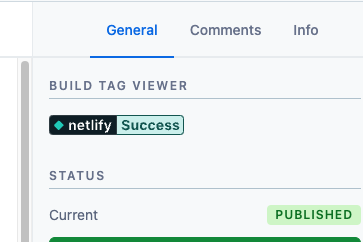

# Contentful App - Build Tag Viewer

  

Display images such as build/release informations in sidebar

 

 - Supports Multiple images
 - Supports custom polling interval
 - Conditional display based on:
    - Tag
    - Id
 - Dynamic Image url from entry (using a field)
 
 ### Todo
 - [ ] Color format config screen
 - [ ] move away from json based config screen
